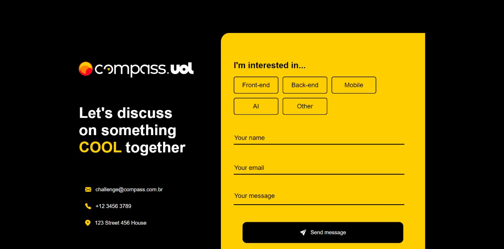

# Desafio - Formulário de Contato

- Projeto desenvolvido com o objetivo de enviar os dados de contato de um formulário para uma API, como definido no desafio Compass.
  

## Instalação do projeto

- **Atenção!** É necessário ter o NodeJS instalado.
- Instalação do pacote <a href="https://cli.vuejs.org">CLI do Vue</a>:

```
npm install -g @vue/cli
```

- Para que o projeto consiga rodar localmente com base na API configurada para o localhost, é necessário seguir os passos mostrados em <a href="https://github.com/micheltlutz/dev-challenge/blob/main/readme_files/challenged.md">instruções</a>.
  - Caso opte por não rodar a API localmente, é necessário trocar a 'baseURL' no arquivo 'src/http/index.ts', deixando comentada a linha 4 e descomentando a linha 5. 
- Após o docker configurado e rodando. Abra um terminal dentro da raiz do projeto baixado e rode:

```
npm install
```

- O projeto necessita da instalação do axios para realizar a comunicação com a API:

```
npm install axios
```

## Execução

- Com o projeto configurado, basta rodar o comando abaixo para disponibilizar o endereço (http://localhost:8080/):

```
npm run serve
```

## Tecnologias

- Vue, JavaScript, TypeScript, HTML e CSS
